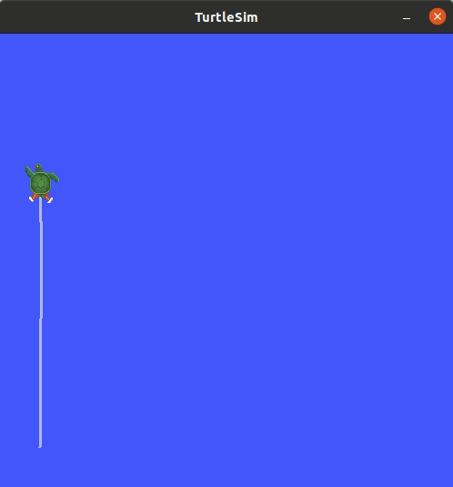

# Turtlesim moved to ROS2.

After winning the chess game with college it was time for me to conquer the turtle in ROS2 world. Thanks to Davide, now for trusting me. Give the limited time to migrate the package I had to work very quick. So, I made changes that will make the code readable and modular so it can be expanded later to add further functionalities if necessary.

## Table of content
1. [Requirement to run the project](#1-requirement-to-run-the-project)
    - [Installation in Docker](#11-docker)
    - [Native installation](#12-native-installation)
2. [Running the project](#2-running-the-project)
    - [Install turtlesim](#21-installing-turtlesim)
    - [Building the project](#22-building-the-project)
    - [Configuring goal points](#23-configure-goal-points)
    - [Running the code](#24-running-the-code)
3. [Documentation](#3-documentation)
4. [TODO](#4-todo)

# Introduction
The package is named `rosp_layered_exercise` to comply with company's naming policy. The directory structure is as follows

```bash
rosp_layered_exercise/
├── assets
│   ├── result.gif
│   └── result.png
├── doc
│   ├── html
│   │   ├── ...
│   │   ├── ...
│   │   ├── index.html #main page of doxygen document
│   │   ├── ...
│   └── manifest.yaml
├── CMakeLists.txt
├── config
│   └── turtlesim_control_params.yaml #file to store goal points
├── include
│   └── rosp_layered_exercise
│       └── turtlebotGoalPublisher.hpp
├── launch
│   └── turtle.launch
├── package.xml
├── README.md
└── src
    └── rosp_layered_exercise.cpp

5 directories, 7 files
```

## 1. Requirement to run the project.
The basic requirement is to have a working version of ROS2 running on your PC either via docker or a native installation.

### 1.1 Docker:
If you are planning to work with docker then [this ROS Tutorial](https://docs.ros.org/en/humble/How-To-Guides/Run-2-nodes-in-single-or-separate-docker-containers.html) would be a good place to start. Remember to enable `xhost` to view GUI from docker and set the volume accordingly so that if you have the package locally you can mount them inside the docker.

### 1.2 Native installation
ROS2 is compatible with Windows, Ubuntu and macOS. So you can install them directly using the [official ROS2 documentation](https://docs.ros.org/en/foxy/Installation.html). This project was tested in on ROS foxy but is forward compatible since it doesn't have much dependencies.

## 2. Running the project.

### 2.1 Installing Turtlesim
This project uses the `turtlesim` package to demonstrate the migration work. So you need to install it as a perquisite using the following command.

```bash
sudo apt update

sudo apt install ros-<ros-version>-turtlesim
```

If you have installed ROS2 properly and source the installation then you can use `rosversion -d` command to know the version you have installed.

### 2.2 Building the project.

You can clone the project using the following command

```bash
git clone https://github.com/brolinA/rosp_layered_exercise.git
```

Then, move the package to the ROS2 workspace you have and build it

```bash
colcon build --packages-select rosp_layered_exercise 
```
Once package build is successful you need to configure the goal points in the [turtlesim_control_params.yaml](config/turtlesim_control_params.yaml) file.

### 2.3 Configure goal points

The [turtlesim_control_params.yaml](config/turtlesim_control_params.yaml) file contains certain parameters that could be tuned to your need. The following shows a snippet from the file.

```yaml
layered_exercise_node:
  ros__parameters:
    proportional_gain:
      linear: 2.0
      angular: 5.0

    no_of_goal: 16
    goal1: [ 1.0, 8.0, 0.0]
    goal2: [ 3.0, 8.0, 0.0]
    goal3: [ 3.0, 5.0, 0.0]
```

- `proportional_gain.linear` - *(float)* proportional controller gain for linear movement.
- `proportional_gain.angular` - *(float)* proportional controller gain for angular movement.
- `no_of_goal` - *(int)* defines the number of goal points to reach. 
- `goal*` - *(float vector)* defines the goal coordinates to reach. **Format:** `(x, y, theta)`

**Note:** 
- The number of points `goal*` should match the `no_of_goal` value. If you miss one of the goal points then an error will be thrown and it will be skipped. For example if `no_of_goal` is **5** but you forgot to define **goal3** then it will be skipped without terminating the code.

- The size of `goal*` should be **3**. If this is not the case, then this point will also be skipped without terminating the code. **Eg:** if you define `goal3: [1.0, 2.0]`, this will be skipped with an error message without terminating the code.

- If you set `no_of_goal: 15` but define only `goal1` to `goal10`, the missing 5 goals will be ignored. This also means, if you define `goal1` to `goal10` but set `no_of_goal: 5`, then only the first 5 goals will be reached.

### 2.4 Running the code
Once the goal points are set you can run the code using the launch file. You can find both the python-based and XML based launch file. The launch file will first launch a turtlesim node, then kill the turtle and spawn a new once at a predefined location in the launch file. Then start the `rosp_layered_exercise` node which will move the robot to the locations defined in the *yaml* file.

```bash
#XML launch file
ros2 launch rosp_layered_exercise turtle.launch
```
```bash
#Python launch file
ros2 launch rosp_layered_exercise turtle.launch.py
```

You will notice that the print messages are less frequent to avoid information overload in the terminal. I have used `RCLCPP_INFO_THROTTLE` to achieve this.

Once the code runs successfully, you will see the turtle moving to the defined goals.



## 3. Documentation.
The code is documented using `doxygen` for ease of understanding. You can open the [index.html](doc/html/index.html) file in a browser of your choice to view the documentation. This will give you better understanding of different functions and variables in the code. 

**Note:** 
I have used `rosdoc_lite` to generate the documentation. `rosdoc2` is the officially supported package for ROS2. But since I have working projects in ROS1 that uses `rosdoc_lite` I wasn't able to use `rosdoc2` to generate the document.

### 4. TODO
1. Defining `goal*` in the yaml file is not a robust way to do it because if you make a spelling mistake in the word `goal` then it will not be read into the code. Instead, we can use avoid it by removing the identifier word `goal*` and define the goals as a `vector<vector<>>` and use the [YAML-CPP](https://github.com/jbeder/yaml-cpp) library to parse the `yaml` file directly. I have used this in ROS1 and it will take some time to verify if it works properly in ROS2. So I am not using it here now.